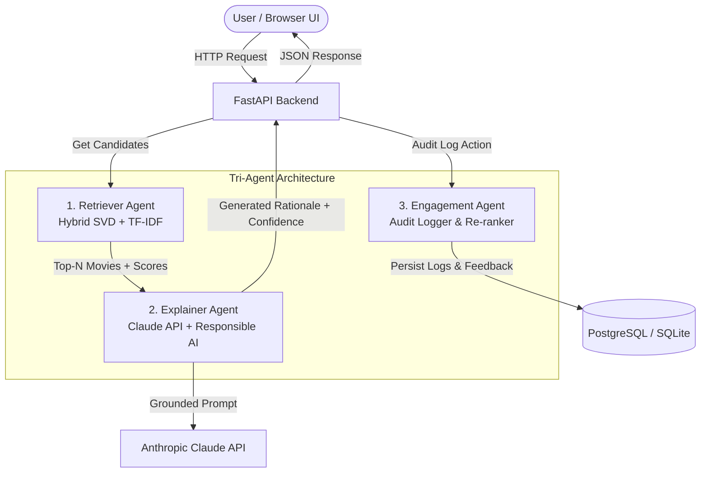

# 🎬 CineSense — AI-Powered OTT Content Recommendation & Engagement Agent

**CineSense** is a production-grade, hackathon-ready OTT content recommendation platform built with a **Tri-Agent AI architecture**. Every movie recommendation presented to the user comes with a **plain-English rationale** generated by an LLM-powered Explainer Agent, explicit **confidence levels (HIGH, MEDIUM, LOW)**, and full **Responsible AI auditability**.

---

## 🌟 Key Features

1. **Tri-Agent Multi-Agent Architecture**:
   - **Retriever Agent** (`services/retriever.py`): Candidate generation using a hybrid engine (Content TF-IDF cosine similarity + Collaborative ratings similarity + dynamic re-ranking based on user interactions).
   - **Explainer Agent** (`services/explainer.py`): Generates grounded 1-2 sentence plain-English explanations using Anthropic Claude API. Evaluates user rating volume to assign confidence level (`HIGH`, `MEDIUM`, `LOW`).
   - **Engagement Agent** (`services/engagement.py`): Logs all agent recommendations, LLM rationales, confidence tags, and user interactions (`click`, `watchlist_add`, `dismiss`, `rate`) into a persistent audit trail.

2. **Responsible AI Guardrails**:
   - **Explainability**: Zero black-box recommendation scores. Every card shows human-readable rationale.
   - **Confidence Badges**: Clear badges (`High Match`, `Good Match`, `Low Confidence — Exploratory Pick`).
   - **No Hallucinated History**: Explainer Agent prompt strictly enforces citing only real watched titles/genres from the database.
   - **Cold-Start Fallback**: Transparent template-based explanations for new users without fabricated history.
   - **Audit Trail**: Real-time decision table at `/api/admin/audit-logs` and Admin UI tab.

3. **Premium Dark OTT UX**:
   - Built with React 18, TypeScript, Tailwind CSS, TanStack Query, and Recharts.
   - Shimmer skeleton loaders, micro-interactions, responsive grid, and interactive onboarding rating flow.

---

## 🏗️ Architecture Diagram



---

## 🚀 Quickstart Guide

### Option 1: One-Command Spin-up via Docker Compose (Recommended)

```bash
# 1. Clone repository & copy environment variables
cp .env.example .env

# 2. Build and launch all services (Backend, Frontend, Postgres, Redis)
docker-compose up --build
```
- **Frontend App**: `http://localhost:3000`
- **FastAPI OpenAPI Docs**: `http://localhost:8000/docs`

---

### Option 2: Local Manual Setup

#### 1. Backend Setup (Python 3.11+)

```bash
cd backend
python -m venv venv
# On Windows:
venv\Scripts\activate
# On Linux/macOS:
source venv/bin/activate

pip install -r requirements.txt

# Seed database with movies, demo users, and ratings
python scripts/seed_db.py

# Start FastAPI server
uvicorn app.main:app --reload --port 8000
```

#### 2. Frontend Setup (Node.js 18+)

```bash
cd frontend
npm install
npm run dev
```

---

## 🧪 Testing & Verification

### 1. Run Fast Backend Smoke Test (<10 seconds)
```bash
python backend/scripts/smoke_test.py
```

### 2. Run Backend Pytest Suite
```bash
cd backend
pytest
```

### 3. Run Frontend Vitest Suite
```bash
cd frontend
npm run test
```

---

## 📑 API Reference Summary

| Method | Endpoint | Description |
| uppercase | --- | --- |
| `GET` | `/api/auth/users` | List available demo users for profile switching |
| `GET` | `/api/recommendations?user_id=1` | Get personalized recs with rationales & confidence tags |
| `GET` | `/api/movies` | Search and browse movie catalog with genre filters |
| `GET` | `/api/watchlist?user_id=1` | Fetch user watchlist |
| `POST` | `/api/watchlist` | Add movie to watchlist |
| `DELETE` | `/api/watchlist` | Remove movie from watchlist |
| `POST` | `/api/engagement/interact` | Record clicks, dismissals, or card interactions |
| `POST` | `/api/engagement/rate` | Submit movie rating (updates recommendation model) |
| `GET` | `/api/admin/audit-logs` | Responsible AI audit log table of agent decisions |
| `GET` | `/api/admin/analytics` | Engagement & agent confidence metrics for dashboard |
